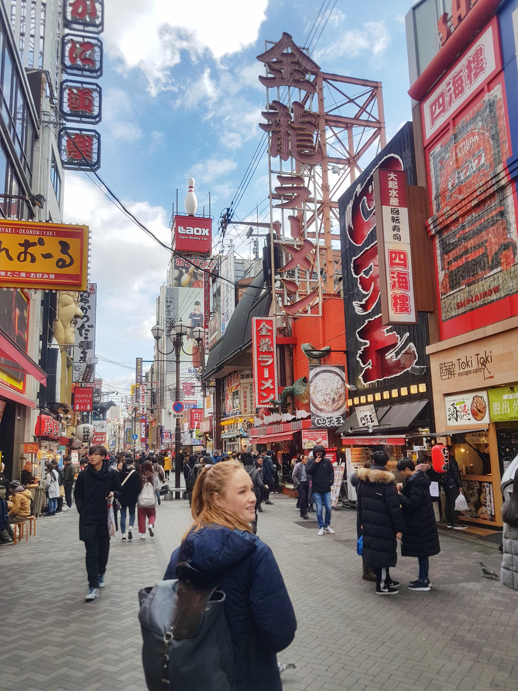

    # y-summer-in-markdown

# Heading 1

## Heading 2

**hello**

- thing 1
- thing 2 
- thing 3
- thing 4 

[cats](youtube.com)

### Hello my name is Lucas and I am in the 12th grade.

## **About me**
 
- During the summer I went to Japan for a week, and when I came back I hung out with my friends most of the remainder of summer.

- My movie as of now would be deadpool and wolverine, I recently watched it when it came out with my mom.

- One of my favorites foods I ate a lot this summer was steak. I taught myself how to cook my steak medium rare almost 95% of the time and 95% of the time it is always delicious.

- One of my future aspirations as for this year is to make a lot off crypto so money wouldn't be much of a worry during my college years

- One of the songs on my summer playlist is mostly RnB and upbeat songs. I personally don't like rap songs with a lot of vulgar messages or negative things said in those songs.

<u>

## Here are some pictures I took this summer

